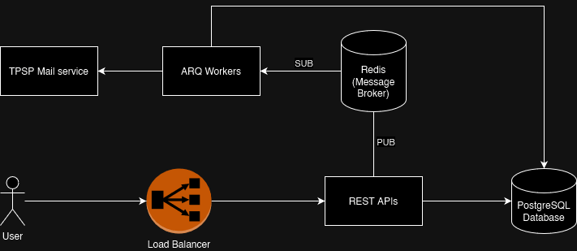

## Launching the application
To start the application, execute the following command:

```
docker compose --profile app up --build -d
```

The API and worker will wait for the databases containers to be healthy, but if you encounter any connection problem between them,
restarting the containers should fix the problem.
```
docker compose restart app worker
```

This command will construct and initiate all containers in the background.

Additionally, two volumes named database (for PostgreSQL) and redis (for Redis) will be created and linked in 
the project's root directory.

### Executing the tests
We utilize docker compose to execute the tests, ensuring access to PostgreSQL and Redis. Separate test databases 
are employed for each, preventing conflicts with development databases.

To run the tests, use:

```
docker compose run app pytest app/tests
```

For unit testing, a decision was made to employ a real database. While typically one might opt for mocking to enhance 
isolation and enable parallel execution, this approach was favored due to its simplicity in setup, absence of potential
errors stemming from mocks, and minimal overhead.

## Stop the app
```
docker compose --profile app --profile dead-letter down --remove-orphans
```

## Architecture
The app utilizes Redis as a message broker to facilitate asynchronous mail processing. When a new user is created, 
a job is generated and picked up by a worker to send an email and mark the user code as active. This ensures that the 
user can validate their account using the code. This approach guarantees that the email attempt is made even if the app 
experiences downtime, and the user code is only activated after confirming the email was successfully sent.

If multiple retries fail to send the email, the event is redirected to a dead-letter queue. In this exercise, we won't handle these events extensively, but in a real scenario, we might implement mechanisms to retry the event or inspect its parameters to identify the issue.

To test the dead-letter queue functionality, modify the `FORCE_JOB_TO_FAIL` variable in the `.env` file at the root of the project by setting it to 1
```
FORCE_JOB_TO_FAIL=1
```

When a new user is created, the send_mail function will fail, and the worker will queue the event in the dead-letter 
queue. You can then use the following command to empty the queue and check which job failed:
```
docker compose --profile dead-letter up
```

## Minimalistic architecture diagram

